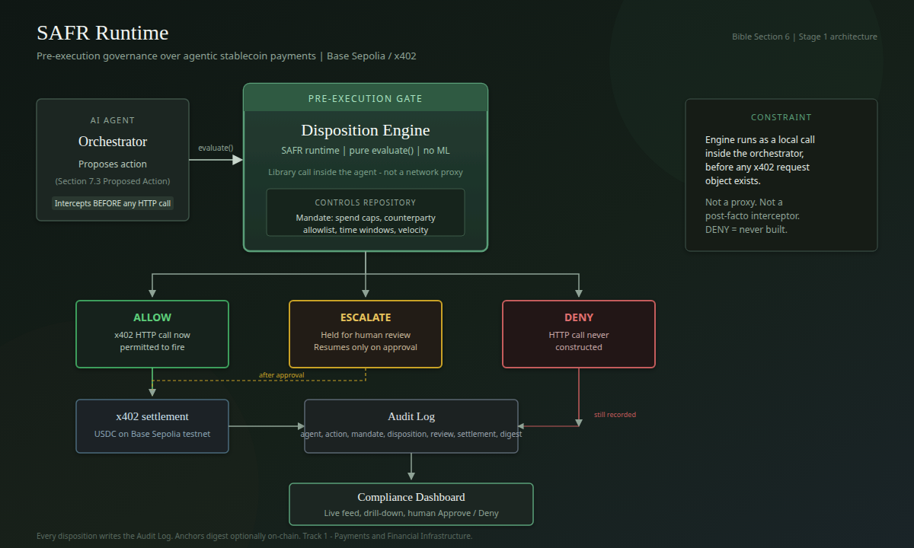

# CERBERUS

### The three-headed guardian of agentic payments

Cerberus is a pre-execution governance runtime and compliance dashboard for payment-capable AI agents. It gives every proposed payment one of three deterministic dispositions — **ALLOW**, **DENY**, or **ESCALATE** — before an x402 payment request can exist.

In Greek mythology, Cerberus guards a boundary that cannot be crossed unchecked. Here, its three heads represent the three possible outcomes at the boundary between an AI agent's intent and financial execution:

- **ALLOW** — the action is within mandate and may proceed to x402 settlement.
- **DENY** — a hard control is breached; no payment request is constructed.
- **ESCALATE** — the action is held until a human reviewer approves or denies it.

An agent proposes a payment. Cerberus evaluates it against a versioned **mandate** — spend caps, permitted currencies, counterparty policy, time windows, and velocity limits — held in the **controls repository**. Every proposal, disposition, triggered rule, human review, and settlement result is written to an audit log a compliance officer can inspect.

The LLM may generate a payment intent. It never makes the compliance decision. The **Disposition Engine is pure, deterministic, rule-based, and reproducible**.

> SAFR is an industry white paper (Version 1.0) published by the Monetary Authority of Singapore under its BuildFin.ai initiative on July 3, 2026. It is **explicitly non-binding** — MAS states it does not constitute regulatory guidance or supervisory expectations. This project implements only SAFR's first applied domain, agent-assisted payments and treasury operations.

**NTU InnovateX Hackathon 2026 — Track 1: Payments and Financial Infrastructure.**



*Cerberus is the product; SAFR Runtime is the governance pattern it implements.*

## Why it matters

A signing key proves that an agent **can** move money. It does not prove that a particular payment is within the institution's authority, risk limits, or operating mandate.

Cerberus places that missing control point before execution. Clear violations are denied immediately. Ambiguous but potentially legitimate actions are escalated for human judgment. Allowed actions continue to the settlement rail. Every outcome leaves evidence.

## What is working

- All three dispositions run end to end: `ALLOW`, `DENY`, and `ESCALATE`.
- `DENY` is proven to stop execution before authorization, executor, or x402 access.
- `ESCALATE` suspends the agent and resumes only after a human decision.
- The agent has no payment key and no payer import. A separate executor accepts only
  short-lived, signed, one-shot Execution Authorizations bound to the exact proposal,
  mandate version, chain, token, atomic amount, payee, and resource.
- The controls repository enforces versioned mandates and rolling counters.
- Budget capacity is committed atomically before authorization, under a lock on the
  mandate rather than the agent, so concurrent requests — including two agents sharing
  one corporate mandate — cannot overspend a rolling window.
- The dashboard provides a live audit feed, drill-down, threshold-versus-actual evidence, and one-click review.
- Terminal audit records are canonically hashed and anchored asynchronously to Base Sepolia.
- **384 automated tests**, TypeScript validation, database verification, and the Next.js production build pass.

## Current finalist build

Everything in this section describes the build as it stands right now. Numbers
elsewhere in the repository that disagree with this section are historical and are
labelled as such.

| | |
|---|---|
| **Source identity** | Recorded by SHA in the generated final-evidence manifest; no hand-maintained “current commit” value |
| **Automated tests** | **384 passed / 384**, 78 suites, 0 failed |
| **Adversarial suite** (`npm run adversarial`) | **12/12 attack classes**, 80 assertions |
| **Security red team** (`npm run redteam`) | **12/12 attack classes**, 70 assertions |
| **Mutation matrix** (`npm run mutation`) | **12/12 security guards proven detectable** |
| **Seeded sandbox** (`npm run sandbox`) | 1000 actions / 50 agents / 25 concurrent — **0 budget violations, 0 duplicate effects, 0 replay violations** |
| **Dependency audit** (`corepack pnpm audit`) | **no known vulnerabilities** |
| **Typecheck / dashboard build / contract compile** | all clean |
| **Continuous integration** | GitHub Actions reproduces the full gate on a clean Linux runner with no wallet secrets; verify the status for the commit being deployed |
| **Database verification** (`npm run db:verify`) | all checks pass |
| **Fresh live evidence** | **CAPTURED on the hardened path.** Three signers provisioned and isolated; DENY, ESCALATE-with-human-approval, ALLOW and a real ambiguous-outcome reconciliation all captured against Base Sepolia. Package: [`artifacts/judge-evidence/`](artifacts/judge-evidence/), summarised in [`08_final/evidence-summary.json`](artifacts/judge-evidence/08_final/evidence-summary.json). |
| **Phase 7 (seeded sandbox)** | **Complete.** `npm run sandbox` |
| **Screen recordings** | Seven screen recordings covering environment/database, credential boundaries, runtime health, DENY, ESCALATE, ALLOW settlement and the reconciliation incident, in [`artifacts/judge-evidence/11_videos/`](artifacts/judge-evidence/11_videos/) |

### Security posture

Assume the AI is hostile. Each statement below is backed by executing assertions, not
by design intent:

- It cannot approve itself, change its mandate, or manufacture budget.
- It cannot reuse execution authority, and cannot access the payment key.
- It cannot change the approved payment.
- **It cannot falsify financial settlement.** The agent's database role has no
  `UPDATE (settlement)` on `audit_log`; terminal settlement is written by the process
  that proved the payment on chain, in the same transaction that settles the
  reservation.
- **It cannot manufacture audit proof.** It holds no anchor signer and has no write
  privilege on `audit_anchor`. Its only finalization power is `INSERT (audit_id)` on a
  durable outbox — a request that a trusted worker satisfies by re-reading the stored
  record and computing the digest itself.
- **Suspending it stops execution.** `agent_identity.status` is enforced at
  authorization issuance, inside the reservation transaction, and twice in the
  executor — including after the merchant's 402 response, so an agent suspended
  mid-flight is refused before the payment key is constructed.
- Neither the merchant nor the AI decides whether money moved — Cerberus verifies the
  chain. The audit verifier now does the same for anchors: it fetches the receipt from
  Base Sepolia and compares the digest read *from the chain* against both the
  recomputed and the stored one.

Full detail, including every attack test and every residual limitation, is in
[submission/SECURITY_REMEDIATION.md](docs/submission/SECURITY_REMEDIATION.md) and
[submission/REDTEAM_REPORT.md](docs/submission/REDTEAM_REPORT.md).

The red-team pass found and fixed two real vulnerabilities — a signed EIP-3009
authorization that could be forwarded across a cross-origin redirect, and an infinite
amount that parsed as a valid proposal — and one security test that could not fail.

### Current limitations

Stated plainly, because a security claim is only worth what its exceptions admit:

- **Authenticated but not a complete internet perimeter.** Capability issuance uses
  its own service bearer credential; reviewer and sensitive dashboard reads use a
  separate reviewer bearer credential; browser CORS is allowlisted; and both trusted
  services bind `127.0.0.1` by default. A public deployment still needs TLS,
  credential rotation, rate limiting, monitoring and network-level controls.
- **Inclusion, not finality.** Settlement proof requires an exact successful on-chain
  transfer. It does **not** wait for a confirmation threshold. A production deployment
  should wait for a configurable confirmation/finality depth before treating
  accounting state as irreversible. The audit verifier reports confirmation depth and
  supports a threshold; the settlement path deliberately does not gate on it, because
  doing so would make every demo ALLOW report `OUTCOME_UNKNOWN` for several blocks.
- **Anchoring requires its worker.** `npm run anchor` must be running for digests to
  reach the chain. If it is not, digests are still stored durably in Postgres and
  records report as pending — never as anchored.
- **Testnet prototype.** Base Sepolia, hackathon scope. Not a production payment
  system.
- **Same-host compromise.** Process isolation is by operating-system boundary and
  database role. An attacker with root on the host defeats it, as they would defeat
  any single-machine deployment.
- **Testnet evidence, not a production track record.** The hardened-path evidence is
  a supervised Base Sepolia run set, captured once, on one machine. It is real and
  independently checkable on chain; it is not an uptime or scale claim.

### Historical Stage-1 evidence

The public transactions below prove the Stage-1 rail and governance flow. They
**predate** the finalist signer-isolation boundary and this remediation pass, and are
retained as history rather than presented as current evidence.

Live settlement and anchoring are explorer-verifiable: the [bare x402 payment](https://base-sepolia.blockscout.com/tx/0xed51af702ebc263f8296c1fc6cb677928880f4a4dc6eee7a05f69e14e99efab9), [AuditAnchor deployment](https://base-sepolia.blockscout.com/tx/0x2cb059b1671678ae8ade38edca8daaa29f8a9e44b758e60484993f3899cebd08), and [final supervised-run anchor](https://base-sepolia.blockscout.com/tx/0x507858741ff5c381167b2b3b85d2e0bb71ec5052e8327dbd78ca40986db1d191) all succeeded on Base Sepolia. The full two-run transaction manifest is in [submission/EVIDENCE.md](docs/submission/EVIDENCE.md).

These prove the Stage-1 rail and governance flow, and are retained as history only.

### Current hardened-path evidence

Captured on the finalist build with the payment, authorization and anchor signers held
by three separate processes. Base Sepolia (`eip155:84532`), USDC
`0x036CbD53842c5426634e7929541eC2318f3dCF7e`, executor `0x35820e5cC60F961515EF987C94D4328a82Df38Fc`,
merchant `0xf56e3F3134879156e11EAff78978a270726B661b`.

| Scenario | Outcome | On-chain |
|---|---|---|
| **DENY** — 5 USDC against a 1 USDC per-transaction cap (`audit_84670a33`) | `per_transaction_cap_exceeded`; the x402 client is **never constructed** | No settlement, because payment authority never existed. Audit anchor [`0xfaabd0…9a7aa`](https://base-sepolia.blockscout.com/tx/0xfaabd09ea1829938d7d447b9aa1152743cd2eae62738873b22366eb631e9a7aa) |
| **ESCALATE** — 0.75 USDC to a counterparty not on the allowlist (`audit_30aa1a70`) | Held for a human; approved by `reviewer:local`; then `SETTLED` | Settlement [`0x55ba3c…25469`](https://base-sepolia.blockscout.com/tx/0x55ba3c22d58a83a1b6093f2e289c544239d4839cd97b008b791d5a6052225469) (`status 0x1`, 750000 atomic). Anchor [`0x3d4659…78877`](https://base-sepolia.blockscout.com/tx/0x3d4659c3890b2061eaf04fc4351b83bce5d496c999259e6a8a55a6290be78877) |
| **ALLOW** — 0.5 USDC within mandate (`audit_ff45a977`) | `within_mandate`; authorized for exactly that action; `SETTLED` | Settlement [`0xfe4d02…c995fa`](https://base-sepolia.blockscout.com/tx/0xfe4d02288ea8882d8b75e520cf627e97d57b04e4f3a3cc81e40b780a36c995fa) (`status 0x1`, 500000 atomic). Anchor [`0xdb4eed…96368`](https://base-sepolia.blockscout.com/tx/0xdb4eed29be7f44d0c7af7375721047219cf6c74c0f87a08b373938a6b9596368) |
| **Ambiguous outcome** — a real incident, not staged (`audit_0aaac796`) | ALLOW, then the signed execution became ambiguous. Capacity stayed held, nothing was blindly retried, the keyless reconciler deferred 17 times, and the EIP-3009 authorization expired unused. Terminal state `FAILED`, `settlement_tx` null, safe to retry | No transfer. `USDC.authorizationState(payer, nonce)` reads **false** and the validity window has elapsed — positive non-payment evidence, not an inference from the merchant's HTTP response. Anchor [`0x156f3e…d62e3`](https://base-sepolia.blockscout.com/tx/0x156f3ed3e17d65a59ca37593befa8eb47b02dae8b44eafbe5b008318db8d62e3) |

`npm run audit:verify` reports **5/5 anchored records proven on chain**. The full
package, its SHA-256 manifest and a read-only re-verification transcript are in
[`artifacts/judge-evidence/`](artifacts/judge-evidence/); per-scenario detail is in
[submission/EVIDENCE.md](docs/submission/EVIDENCE.md).

## Documents

Read in this order. The Bible is the source of truth and overrides everything else.

| File | Purpose |
|---|---|
| [SAFR_RUNTIME_PROJECT_BIBLE.md](docs/SAFR_RUNTIME_PROJECT_BIBLE.md) | Source of truth: concept, schemas, terminology, decision history |
| [PRD.md](docs/PRD.md) | Requirements, users, feature set, scope boundary |
| [Architecture.md](docs/Architecture.md) | Flow, stack, folder structure, the pre-execution interception constraint |
| [Rules.md](docs/Rules.md) | Engineering boundaries (approved stack, frozen schemas, rule-based-only engine) |
| [Critique.md](docs/Critique.md) | Approved Stage-2 security critique and fixed hardening order |
| [Phases.md](docs/Phases.md) | Build phases with a Definition of Done each |
| [Design.md](docs/Design.md) | Dashboard visual design |
| [EDGE_CASES.md](docs/EDGE_CASES.md) | **Current register of every known edge case, limitation and deferred production requirement, verified against this build** |
| [Memory.md](docs/Memory.md) | Working log: current state, decisions, blockers, next step |
| [submission/FINAL_FREEZE.md](docs/submission/FINAL_FREEZE.md) | Release status, exact SHAs, gate results, and the architecture/feature/code freeze policy |
| [submission/RUNBOOK.md](docs/submission/RUNBOOK.md) | Cold start to judged demo, and the failure modes actually hit |
| [submission/EVIDENCE.md](docs/submission/EVIDENCE.md) | Verified local and Base Sepolia evidence, transaction manifest, and known limitations |
| [`artifacts/judge-evidence/`](artifacts/judge-evidence/) | The captured hardened-path evidence package: per-phase logs, screenshots, recordings, SHA-256 manifest and `evidence-summary.json` |

## Stack

TypeScript/Node 22+, pnpm workspaces, Postgres 16 (Docker), x402 v2 TS SDK on **Base Sepolia** (`eip155:84532`), Next.js dashboard. The approved stack is closed — see [Rules.md](docs/Rules.md) R2.

## Quick start — clone, run, and reproduce the results

The deterministic governance path can be verified without spending testnet assets.
A funded Base Sepolia wallet is required only for reproducing live x402 settlement
and on-chain audit anchoring. No LLM API key is required: the reproducible demo uses
fixed, schema-validated Proposed Action fixtures, and the LLM never participates in
the compliance decision.

### Prerequisites

- Git.
- Node.js **22 or newer** (`node --version`).
- Docker with Compose for the default Postgres setup. Alternatively, use any
  Postgres 16+ instance matching `DATABASE_URL` in `.env.example`.
- Free local ports: `5544` (Postgres), `4021` (merchant), `4050` (API), `4060`
  (isolated executor), and `3000` (dashboard).
- For the full on-chain path only: Base Sepolia USDC and a small amount of Base
  Sepolia ETH. Never use a wallet that holds real assets.

### 1. Clone and install

```bash
git clone https://github.com/Harshyadav442277/Cerberus.git
cd Cerberus
corepack enable
pnpm install --frozen-lockfile
```

Corepack selects the exact pnpm version pinned in `package.json`. All remaining
commands are plain `npm run` commands.

### 2. Create the local environment

Linux, macOS, or Git Bash:

```bash
cp .env.example .env
cp .env.agent.example .env.agent
cp .env.executor.example .env.executor
cp .env.authorizer.example .env.authorizer
cp .env.anchor.example .env.anchor
cp .env.reviewer.example .env.reviewer
cp .env.reconciler.example .env.reconciler
cp apps/dashboard/.env.local.example apps/dashboard/.env.local
npm run wallets:new
```

PowerShell:

```powershell
Copy-Item .env.example .env
Copy-Item .env.agent.example .env.agent
Copy-Item .env.executor.example .env.executor
Copy-Item .env.authorizer.example .env.authorizer
Copy-Item .env.anchor.example .env.anchor
Copy-Item .env.reviewer.example .env.reviewer
Copy-Item .env.reconciler.example .env.reconciler
Copy-Item apps/dashboard/.env.local.example apps/dashboard/.env.local
npm run wallets:new
```

Copy each generated value into the file named by the command, and into that file only:
public addresses into `.env`, the x402 payment key into `.env.executor`, the Execution
Authorization key into `.env.authorizer`, and the audit-anchor key into `.env.anchor`.
No private key ever belongs in `.env.agent` — the agent process holds no signer, which
is the property the whole architecture rests on. Generate one high-entropy
`REVIEWER_API_TOKEN` and copy it into
`.env.authorizer`, `.env.reviewer`, and `apps/dashboard/.env.local`; it must never use
the `NEXT_PUBLIC_` prefix or appear in `.env.agent`. Set a separate
`REVIEWER_DASHBOARD_PASSWORD` in `apps/dashboard/.env.local`; the browser prompts the
human reviewer for it when `/escalations` opens. All runtime files are gitignored.
Never paste a private key or reviewer credential into an
issue, screenshot, commit, shared shell profile, or demo.

Replace each `CHANGE_ME_16_CHARS_MIN` database password with a different random value.
The four runtime URLs must keep distinct usernames: the agent, control plane,
executor, and keyless reconciler are intentionally separate PostgreSQL logins. The
root `.env` `DATABASE_URL` is schema-owner authority for migrations, role
provisioning, seed/reset, and tests only; no application process loads it.

You may leave `ANTHROPIC_API_KEY` and `AUDIT_ANCHOR_ADDRESS` empty in `.env.agent` for
local governance verification. `AUDIT_ANCHOR_ADDRESS` is a public contract address, not
a credential; `.env.agent` has no private-key variable to leave empty.

### 3. Start Postgres and initialize the data

```bash
npm run db:up
npm run db:migrate
npm run db:roles
npm run db:seed
npm run db:verify
```

`db:roles` creates or rotates the four LOGIN roles from the process-specific files
and grants each exactly one NOLOGIN group role. It never prints their passwords.

Published mandate policy is version-immutable. Change policy by inserting a new
version (`v17 → v18`), never by rewriting `v17`. Existing versions permit only
one-way lifecycle closure: `active → superseded|revoked` and setting `effective_to`
once.

Expected result: `db:verify` prints **13 `OK` checks** followed by `All checks
passed`, including exact Bible Section 7 columns, lossless zod/Postgres round-trips,
mandate-version boundaries, and the three expected demo dispositions.

If Docker is unavailable, point `DATABASE_URL` at an existing Postgres 16+ instance
on port `5544`; the Windows setup used for the published evidence is documented in
[the operator runbook](docs/submission/RUNBOOK.md).

### 4. Verify the build before starting services

```bash
npm run typecheck
npm test
npm run adversarial
npm run redteam
npm run build --prefix apps/dashboard
npm run contracts:compile
```

Expected result:

- TypeScript exits without errors.
- The test runner reports **384 tests, 78 suites, 384 passed, 0 failed**, then restores
  the canonical demo seed before returning.
  `npm test` requires the Postgres from step 3 to be running: the atomic-reservation
  concurrency and database-privilege tests assert PostgreSQL properties and would
  prove nothing against a stub. The agent-role attacks must return permission denied.
- The judge-facing adversarial verifier reports **12/12 attack classes** and **80
  selected assertions** passed, with zero failed, skipped, or cancelled assertions.
  It validates named TAP evidence and fails if a class matches no tests.
- The security red-team gate (`npm run redteam`) reports **12/12 attack classes** and
  **70 assertions** passed, covering the finalist hardening round, capability/read
  authentication, trusted issuance time, paid-request timeout, and the real agent role.
- The mutation matrix (`npm run mutation`) reports **12/12 security guards proven
  detectable** and leaves the working tree clean. It removes each guard in turn and
  requires the tests that claim to catch it to fail, because a security suite that
  cannot fail is indistinguishable from one that checks nothing.
- The seeded sandbox (`npm run sandbox -- --seed 42 --agents 50 --actions 1000
  --concurrency 25`) reports **0 budget violations, 0 duplicate effects, 0 replay
  violations**, each queried from PostgreSQL after the run.
- The Next.js production build completes and includes server-only authenticated
  reviewer/runtime proxies.
- `AuditAnchor` compiles successfully and reports 263 bytes of deployable bytecode.

The tests include the structural guarantee that `DENY` reaches neither authorization
nor execution, signer isolation, forged/mutated/expired/replayed authorization
refusal before key use, exact live x402 binding, durable EIP-3009 reconciliation and
worker-race fencing, the deterministic rule order, atomic escalation review, audit
hashing, contract compilation, and all three scripted scenarios.

### 5. Start Cerberus

Keep these five terminals running:

Terminal 1 — x402 merchant:

```bash
npm run merchant
```

Terminal 2 — audit and escalation API:

```bash
npm run api
```

Terminal 3 — isolated payment executor:

```bash
npm run executor
```

Terminal 4 — compliance dashboard:

```bash
npm run dashboard
```

Terminal 5 — keyless ambiguous-outcome reconciler:

```bash
npm run reconciler
```

The reconciler has its own least-privilege database login and a public RPC URL. It
does not load the operator `.env`, executor payment key, authorization key, reviewer
credential, or audit-anchor key. `npm run reconciler -- --once` claims at most one
due item and exits, which is useful for recovery checks.

Open <http://localhost:3000>. The sidebar should show `CERBERUS / SAFR Runtime`, the
Audit Log status should become `Live`, and the footer indicators should show Base
Sepolia, Database, and Facilitator.

Optional health check:

```bash
curl http://localhost:4021/health
curl http://localhost:4050/health
curl http://localhost:4060/health
curl -I http://localhost:3000
```

Expected result: merchant `status: ok`, API `ok: true` with `database: up`, executor
role `isolated-payment-executor`, and an HTTP success response from the dashboard.

### 6. Reproduce ALLOW, DENY, and ESCALATE

In a fifth terminal, start the trusted scripted reviewer, then run the deterministic
three-scenario sequence in a sixth terminal:

```bash
npm run reviewer:auto
npm run demo:script
```

The command resets the demo state, runs all three proposals, asserts the expected
dispositions, persists their audit records, and waits for asynchronous digest work to
finish. The important output is:

```text
dispositions  ALLOW → DENY → ESCALATE(approved)  ✓
interception  DENY never reached x402           ✓
human_review  persisted on scenario 3           ✓
```

Run the reliability check with three clean resets:

```bash
npm run reviewer:auto -- --count=3
npm run demo:script -- --thrice
```

Expected final line: `Three consecutive clean runs succeeded.` An unfunded payer can
still reproduce the dispositions and the DENY interception guarantee, but permitted
settlements will not have transaction hashes.

### 7. Reproduce the real human approval hold

With the API and dashboard still running:

```bash
npm run demo -- new_counterparty
```

Then open <http://localhost:3000/escalations>. The agent remains blocked until you
click **Approve** or **Deny**. Approve should unblock the separate agent process,
persist `human_review`, and reach settlement; Deny should leave settlement null.

The browser never receives the API reviewer token: opening `/escalations` first
requires the separate human reviewer login, and the authenticated decision is then
forwarded by a server-only Next.js route. Direct calls to either the proxy or API
without their respective credentials are rejected before `human_review` or
`human_approval` can be written.

### 8. Reproduce live settlement and on-chain anchoring

This step spends testnet-only assets. Fund the generated executor wallet with
approximately **4 Base Sepolia USDC** for several rehearsals. Fund the separate audit
anchor signer with a small amount of Base Sepolia ETH for deployment and anchors.

- USDC: <https://faucet.circle.com> — select Base Sepolia.
- ETH: <https://www.alchemy.com/faucets/base-sepolia>.

With the merchant running:

```bash
npm run phase1:preflight
npm run phase1
```

Do not proceed until preflight reports every prerequisite as `OK`. `phase1` should
print a transaction hash that resolves on the
[Base Sepolia Blockscout explorer](https://base-sepolia.blockscout.com).

Deploy a fresh audit anchor for your clone:

```bash
npm run contracts:deploy
```

Copy the printed contract address into `.env`, `.env.agent`, and `.env.anchor` as
`AUDIT_ANCHOR_ADDRESS`. It is a public address, not a credential. The audit-anchor
private key stays in `.env.anchor`, read only by `npm run anchor`; the agent never
receives it. Then run:

```bash
npm run demo:script -- --live
npm run audit:verify
```

Expected result after approving scenario 3: ALLOW and approved ESCALATE have distinct
settlement hashes, DENY has no settlement, and `audit:verify` reports **3/3 records
reproduce their digest**, **3/3 anchored on Base Sepolia**, and `No tampering
detected`. Your transaction hashes will differ from the published run; the behavior
and invariants should match [the evidence manifest](docs/submission/EVIDENCE.md).

### 9. Stop the local stack

Stop the merchant, API, and dashboard with `Ctrl+C` in their terminals, then stop the
default Docker database:

```bash
npm run db:stop
```

## Phase 1 — bare x402 payment

Proves the payment rail works in isolation, with **zero** governance logic in front of it, before anything is built on top of it (Bible Section 10, step 1).

```bash
# Terminal 1 — the merchant being paid (x402 resource server).
npm run merchant

# Terminal 2 — check prerequisites, then fire one real testnet payment.
npm run phase1:preflight
npm run phase1
```

`phase1` prints a settlement transaction hash verifiable on the
[Base Sepolia Blockscout explorer](https://base-sepolia.blockscout.com). `phase1:preflight` reports
exactly which prerequisite is missing if it cannot.

## The three-headed demo

The three scenarios from Bible Section 9, end to end.

```bash
# Terminal 1 — the merchant being paid.
npm run merchant

# Terminals 2 and 3 — trusted authorization API and isolated executor.
npm run api
npm run executor

# Terminal 4 — keyless reconciliation worker.
npm run reconciler

# Terminal 5 — agent proposes, engine decides, settlement only if permitted.
npm run demo
npm run demo -- cap_breach                        # one scenario

# To script a rejection, start this trusted command in another terminal first.
npm run reviewer:auto -- --decision=denied
npm run demo -- new_counterparty
```

Output reports, per scenario, the disposition, the rule that fired, and — the line
that matters — whether x402 was reached at all:

```
Scenario 2 — cap breach   [cap_breach]
  disposition   DENY
  rule          spend_caps.per_transaction_max
  x402 reached  NO — never constructed
```

## The audit trail

Every disposition is written to Postgres as a Bible Section 7.5 record — a refusal is
recorded exactly as carefully as an approval. Once a record reaches its terminal
state, Cerberus computes `keccak256` of its canonical JSON. When anchoring is
configured, that digest is written to [`AuditAnchor.sol`](contracts/AuditAnchor.sol)
on Base Sepolia. Only the digest goes on chain; the record itself never leaves the
database.

```bash
npm run audit:verify        # re-hash every stored record, compare to its anchor
npm run audit:tamper-demo   # edit a real record, watch the digest break, roll back
```

`audit:tamper-demo` is the honest version of the immutability claim. It takes a stored
`DENY`, rewrites it to `ALLOW` the way someone covering their tracks would, and shows
the digest no longer reproduces — then rolls the transaction back so the log is
unchanged.

Anchoring is asynchronous and cannot affect a decision: the digest is stored before
any network call, and a slow, broken, or unconfigured RPC leaves the record valid and
the disposition untouched.

To deploy the contract (needs a little Sepolia ETH for gas):

```bash
npm run contracts:compile
npm run contracts:deploy    # prints the address for AUDIT_ANCHOR_ADDRESS in .env
```

Without `AUDIT_ANCHOR_ADDRESS` set, records still get digests and stay verifiable —
they simply sit at `pending` until anchoring is configured.

## Cerberus compliance dashboard

```bash
# Terminal 1 — API (audit feed + escalation decisions)
npm run api

# Terminal 2 — isolated payment executor
npm run executor

# Terminal 3 — Next.js dashboard at http://localhost:3000
npm run dashboard

# Terminal 4 — hold an escalation for a real authenticated Approve click
npm run demo -- new_counterparty
```

The Audit Log shows disposition colour, the rule path on DENY rows, and a live
indicator. Escalations is one-click Approve / Deny with no confirmation dialog.

## Judged demo script (Phase 7)

Bible Section 9 in order, with approval supplied by a separate trusted reviewer
process and a clean reset between attempts:

```bash
npm run merchant          # terminal 1
npm run api               # terminal 2
npm run executor          # terminal 3
npm run reconciler        # terminal 4, keyless chain reconciliation
npm run reviewer:auto     # terminal 5, trusted control plane
npm run demo:script       # terminal 6, agent process (resets first)
npm run reviewer:auto -- --count=3  # use with demo:script -- --thrice
```

Each run asserts ALLOW → DENY (`spend_caps.per_transaction_max`, x402 never
constructed) → ESCALATE approved with `human_review` persisted. Two fresh supervised
runs settled both permitted payments and anchored all three audit outcomes on Base
Sepolia; exact hashes are recorded in [submission/EVIDENCE.md](docs/submission/EVIDENCE.md).

## Layout

```
packages/
  core/                 shared zod schemas, Bible Section 7
  db/                   Postgres pool, migrations, seed data
  disposition-engine/   pure, rule-based evaluate() — the gate
  controls-repository/  versioned mandate lookup + counters
  x402-client/          payer-side x402 implementation, imported only by executor
  execution-authorization/ signed capability schema, hashing, signing, verification
  audit-log/            Section 7.5 writes + canonical hash + on-chain anchor
apps/
  agent/                LLM agent + orchestrator — owns the gate
    src/settlement/     HTTP clients for authorizer and executor; no signer or x402
  executor/             isolated payment-key process; the only payer importer
  reviewer/             trusted scripted-reviewer process; holds reviewer credential
  merchant/             x402 resource server (the payee)
  api/                  dashboard REST + SSE live feed
  dashboard/            Next.js compliance dashboard
contracts/              AuditAnchor.sol + compile and deploy scripts
```

The Disposition Engine is called by the agent's own orchestration code **before it
constructs the x402 request** — never as a proxy in front of x402 traffic. This
pre-execution position is the whole point; see [Architecture.md](docs/Architecture.md) section 2.

It is enforced rather than merely intended. `npm test` scans the repository and fails
if any app except `apps/executor` imports the payer-side x402 client, if the agent
references a payment-key variable, or if code patches global `fetch`, installs a
proxy agent, or intercepts traffic after the fact. On `DENY`, neither the
authorization client nor executor client is constructed.
